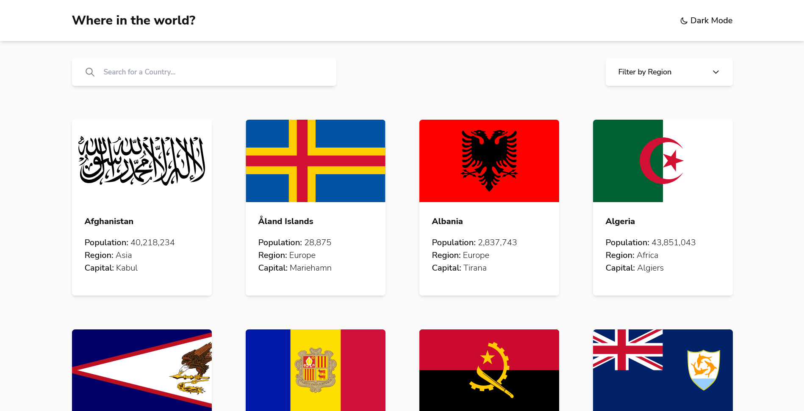

# Frontend Mentor - REST Countries API with color theme switcher solution

This is a solution to the [REST Countries API with color theme switcher challenge on Frontend Mentor](https://www.frontendmentor.io/challenges/rest-countries-api-with-color-theme-switcher-5cacc469fec04111f7b848ca). Frontend Mentor challenges help you improve your coding skills by building realistic projects.

## Overview

### Screenshot

### Links

-   Solution URL: [Solution file](https://github.com/OussamaZouaine/Front-end-mentor-challenges/tree/main/rest-countries-api-with-color-theme-switcher-master)
-   Live Site URL: [The live site](https://oussamazouaine.github.io/Front-end-mentor-challenges/profile-card-component/index.html)
